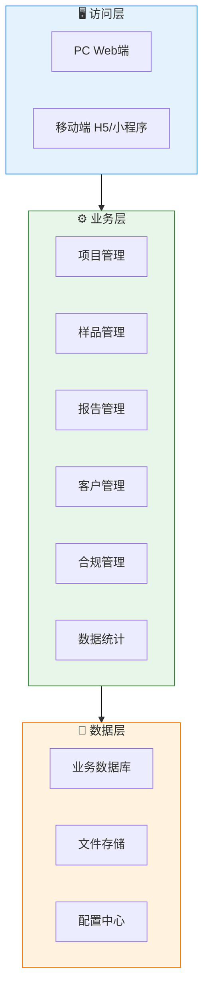
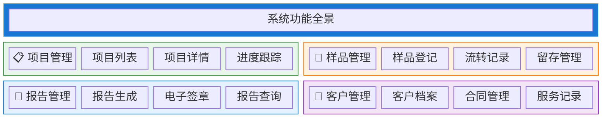
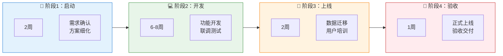

<div align="center">

# 君安检测业务项目管理系统
## 解决方案

**客户**：浙江君安检测技术有限公司
**版本**：V1.0
**日期**：2026年3月

---

*本方案基于检测行业痛点分析，为君安检测量身定制*

</div>

---

## 目录

- [1. 执行摘要](#1-执行摘要)
- [2. 项目背景](#2-项目背景)
- [3. 需求理解](#3-需求理解)
- [4. 解决方案](#4-解决方案)
- [5. 实施计划](#5-实施计划)
- [6. 投资与回报](#6-投资与回报)
- [7. 风险与保障](#7-风险与保障)
- [8. 为什么选择我们](#8-为什么选择我们)
- [9. 下一步行动](#9-下一步行动)

---

## 1. 执行摘要

**一句话概括**：为君安检测打造覆盖检测业务全流程的项目管理系统，实现从合同签订到报告出具的一站式数字化管理。

### 1.1 项目概览

| 项目 | 内容 |
|------|------|
| **客户名称** | 浙江君安检测技术有限公司 |
| **项目名称** | 业务项目管理系统 |
| **项目类型** | 新建 |
| **核心目标** | 实现检测业务全流程数字化管理，提升效率，降低合规风险 |
| **预计投资** | 15-25万 |
| **预计周期** | 2-3个月 |
| **预期 ROI** | 12-18个月回本 |

### 1.2 核心价值

<table>
<tr>
<td width="25%" align="center">
<h3>📈</h3>
<b>效率提升50%+</b><br>
全流程线上化，告别Excel
</td>
<td width="25%" align="center">
<h3>💰</h3>
<b>合规风险归零</b><br>
资质、设备、标准自动预警
</td>
<td width="25%" align="center">
<h3>⚡</h3>
<b>报告周期缩短30%</b><br>
自动化流转，电子签章
</td>
<td width="25%" align="center">
<h3>🛡️</h3>
<b>数据完全可控</b><br>
客户资源公司化管理
</td>
</tr>
</table>

### 1.3 方案亮点

| # | 亮点 | 说明 |
|---|------|------|
| 1 | **行业适配** | 专为放射卫生检测设计，覆盖全部200+检测项目 |
| 2 | **轻量部署** | SaaS模式，无需自建服务器，快速上线 |
| 3 | **移动友好** | 支持现场采样、移动审批，随时随地办公 |
| 4 | **合规保障** | 内置资质管理、设备校准提醒，满足CNAS要求 |

---

## 2. 项目背景

### 2.1 客户概况

浙江君安检测技术有限公司成立于2012年，专注于放射卫生检测与评价服务。公司拥有甲级资质，具备200余项检测能力，配备50余台高精密检测设备，技术人员占比60%以上。

服务范围涵盖医疗机构、企事业单位的放射装置检测、场所防护检测、个人剂量监测、建设项目评价等全业务链条。

### 2.2 现状与挑战

#### 当前现状

公司业务管理主要依赖Excel表格和基础办公软件，项目信息分散在业务人员个人电脑中，缺乏统一的业务管理平台。

#### 面临的挑战

| # | 挑战 | 影响 | 紧迫性 |
|---|------|------|--------|
| 1 | 项目进度不透明 | 无法实时掌握项目状态，客户催单难以应对 | 🔴 高 |
| 2 | 样品追溯困难 | 样品流转靠手工记录，错检、漏检风险高 | 🔴 高 |
| 3 | 报告签章繁琐 | 纸质报告流转慢，签发周期长 | 🟡 中 |
| 4 | 客户资源分散 | 客户信息掌握在业务员个人手中 | 🟡 中 |
| 5 | 合规风险高 | 资质过期、设备校准靠人工记忆，风险大 | 🔴 高 |

### 2.3 项目背景

随着业务规模扩大，公司正在招聘更多销售代表和评价工程师，传统手工管理模式已无法支撑发展。建设统一的业务项目管理系统成为当务之急。

---

## 3. 需求理解

### 3.1 核心需求

我们理解，客户最核心的需求是：**实现检测业务从合同签订到报告出具的全流程数字化管理，提升效率，降低合规风险。**

#### 业务需求

| # | 需求 | 优先级 | 来源 |
|---|------|--------|------|
| 1 | 项目全流程管理（合同-采样-检测-报告） | P0 必须 | 行业痛点分析 |
| 2 | 样品流转管理（接收-登记-检测-留存） | P0 必须 | 行业通用需求 |
| 3 | 报告生成与签章管理 | P0 必须 | 行业通用需求 |
| 4 | 客户信息管理 | P1 重要 | 业务痛点 |
| 5 | 人员资质与设备校准管理 | P1 重要 | 合规要求 |

#### 技术需求

| # | 需求 | 说明 |
|---|---|------|
| 1 | 云端部署 | 便于多地办公、移动访问 |
| 2 | 数据安全 | 检测数据保密要求高 |
| 3 | 易用性 | 一线人员IT基础不一，系统需简单易用 |

### 3.2 约束条件

| 约束类型 | 具体要求 | 备注 |
|----------|----------|------|
| **预算** | 15-25万 | 可根据方案调整 |
| **时间** | 2-3个月 | 需尽快见效 |
| **技术** | 云端SaaS优先 | 降低IT维护成本 |
| **资源** | 需客户配合需求确认 | 预留2-3周沟通时间 |

### 3.3 成功标准

| # | 标准 | 当前值 | 目标值 | 衡量方式 |
|---|------|--------|--------|----------|
| 1 | 报告出具周期 | 7-10天 | 5-7天 | 系统统计 |
| 2 | 项目进度可视化 | 0% | 100% | 随时可查 |
| 3 | 样品追溯能力 | 靠人工记录 | 全程可追溯 | 扫码查询 |
| 4 | 合规风险事件 | 每年1-2次 | 0次 | 系统预警 |

---

## 4. 解决方案

### 4.1 方案概述

#### 整体思路

采用"轻量化SaaS + 移动端"架构，围绕检测业务核心流程，构建"项目-样品-报告-客户"四位一体的业务管理平台。

系统重点解决三大问题：
1. **看得见**：项目进度实时可视
2. **管得住**：合规风险自动预警
3. **效率高**：流程自动化流转

#### 方案架构图



### 4.2 功能设计

#### 功能全景



#### 核心功能详解

**功能模块1：项目管理**

| 功能 | 说明 | 价值 |
|------|------|------|
| 项目立项 | 支持手动创建、从合同导入 | 快速启动项目 |
| 任务分解 | 检测任务自动分解到人 | 责任清晰 |
| 进度看板 | 可视化展示项目状态 | 一目了然 |
| 到期提醒 | 临期项目自动预警 | 避免延误 |

**功能模块2：样品管理**

| 功能 | 说明 | 价值 |
|------|------|------|
| 样品接收登记 | 扫码/手动登记样品信息 | 快速入库 |
| 流转记录 | 记录样品在各部门流转 | 全程追溯 |
| 检测状态 | 实时更新检测状态 | 进度透明 |
| 留样管理 | 留样期限到期提醒 | 符合规范 |

**功能模块3：报告管理**

| 功能 | 说明 | 价值 |
|------|------|------|
| 报告模板 | 预置多种报告模板 | 快速生成 |
| 数据自动填充 | 检测数据自动导入 | 减少录入 |
| 电子签章 | 支持电子签章 | 快速签发 |
| 报告查询 | 按条件查询历史报告 | 便捷查阅 |

**功能模块4：合规管理**

| 功能 | 说明 | 价值 |
|------|------|------|
| 人员资质 | 资质证书到期提醒 | 避免过期 |
| 设备校准 | 校准周期自动提醒 | 确保有效 |
| 标准更新 | 法规标准更新通知 | 合规经营 |

### 4.3 技术方案

#### 技术架构

| 层次 | 技术选型 | 说明 |
|------|----------|------|
| 前端 | Next.js 16 + React | 现代化、高性能 |
| 样式 | Tailwind CSS + shadcn/ui | 美观易用 |
| 后端 | Node.js/Go | 高效稳定 |
| 数据库 | PostgreSQL | 安全可靠 |
| 部署 | 云服务器（阿里云/腾讯云） | 按需付费 |

#### 技术亮点

- **响应式设计**：PC/移动端自适应
- **离线支持**：现场采样可离线录入
- **数据加密**：敏感数据传输加密
- **备份机制**：每日自动备份

### 4.4 集成方案

| 集成系统 | 集成方式 | 数据流向 | 说明 |
|----------|----------|----------|------|
| 现有办公系统 | 单点登录 | 双向 | 统一账号管理 |
| 财务系统 | 数据导出 | 单向 | 导出对账单 |
| 微信/钉钉 | 消息通知 | 单向 | 任务提醒推送 |

---

## 5. 实施计划

### 5.1 项目阶段



### 5.2 详细计划

#### 阶段1：需求确认（第1-2周）

| 任务 | 负责方 | 交付物 | 里程碑 |
|------|--------|--------|--------|
| 需求调研 | 双方 | 需求调研报告 | - |
| 方案确认 | 双方 | 确认的功能清单 | ✓ 里程碑1 |
| 原型设计 | 我方 | 原型演示 | - |

#### 阶段2：开发实施（第3-10周）

| 任务 | 负责方 | 交付物 | 里程碑 |
|------|--------|--------|--------|
| 系统开发 | 我方 | 功能模块 | - |
| 内部测试 | 我方 | 测试报告 | ✓ 里程碑2 |
| 试运行环境 | 我方 | 试运行系统 | - |

#### 阶段3：上线准备（第11-12周）

| 任务 | 负责方 | 交付物 | 里程碑 |
|------|--------|--------|--------|
| 数据初始化 | 双方 | 基础数据 | - |
| 用户培训 | 我方 | 培训材料 | ✓ 里程碑3 |
| 操作手册 | 我方 | 用户手册 | - |

#### 阶段4：正式上线（第13周）

| 任务 | 负责方 | 交付物 | 里程碑 |
|------|--------|--------|--------|
| 系统上线 | 我方 | 正式系统 | ✓ 里程碑4 |
| 验收确认 | 双方 | 验收报告 | - |

### 5.3 里程碑

| # | 里程碑 | 时间 | 验收标准 |
|---|--------|------|----------|
| M1 | 需求确认完成 | 第2周 | 功能清单双方签字 |
| M2 | 系统开发完成 | 第10周 | 所有功能可用 |
| M3 | 试运行通过 | 第12周 | 核心流程跑通 |
| M4 | 正式验收 | 第13周 | 验收报告签署 |

### 5.4 项目团队

#### 我方团队

| 角色 | 职责 | 投入 |
|------|------|------|
| 项目经理 | 整体协调、进度管理 | 50% |
| 产品经理 | 需求分析、产品设计 | 50% |
| 开发工程师 | 系统开发 | 2人 |
| 测试工程师 | 测试、质量保障 | 1人 |

#### 客户方配合

| 角色 | 职责 | 投入要求 |
|------|------|----------|
| 项目负责人 | 内部协调、决策 | 每周2小时 |
| 业务专家 | 需求确认、测试验证 | 阶段性投入 |
| IT对接人 | 网络环境、账号管理 | 上线前配合 |

---

## 6. 投资与回报

### 6.1 投资概算

#### 费用明细

| 费用项 | 金额 | 说明 |
|--------|------|------|
| 软件/开发费用 | ¥15-20万 | 含全部功能模块 |
| 实施服务费用 | ¥3-5万 | 培训、数据迁移 |
| 云资源费用 | ¥0.5万/年 | 服务器、存储 |
| 年度维护费用 | ¥2-3万/年 | 系统维护、小版本更新 |
| **合计首年** | **¥20-25万** | - |

#### 付款方式

| 节点 | 比例 | 金额 | 条件 |
|------|------|------|------|
| 合同签订 | 30% | ¥6-7.5万 | 合同生效 |
| 开发完成 | 40% | ¥8-10万 | 功能验收通过 |
| 正式上线 | 20% | ¥4-5万 | 系统上线运行 |
| 质保期满 | 10% | ¥2-2.5万 | 一年后无重大问题 |

### 6.2 投资回报分析

#### 可量化收益

| 收益项 | 计算方式 | 年度收益 |
|--------|----------|----------|
| 报告效率提升 | 每份报告节省2小时 × 1000份/年 | ¥5万 |
| 减少返工 | 降低10%返工率 | ¥3万 |
| 合规风险避免 | 避免1次处罚/投诉 | ¥5-10万 |
| **合计** | - | **¥13-18万/年** |

#### ROI 分析

```
投资总额：¥20-25万
年度收益：¥13-18万
投资回收期：15-20个月

ROI = (18万 × 3 - 25万) / 25万 × 100% = 116%（3年）
```

#### 无形价值

- **品牌形象**：数字化管理提升客户信任度
- **决策支撑**：数据支撑经营决策
- **团队成长**：提升团队数字化能力

---

## 7. 风险与保障

### 7.1 风险识别与应对

| # | 风险 | 概率 | 影响 | 应对措施 |
|---|------|------|------|----------|
| 1 | 需求变更 | 🟡 中 | 🟡 中 | 分阶段实施，预留灵活性 |
| 2 | 用户接受度 | 🟢 低 | 🟡 中 | 充分培训，逐步推广 |
| 3 | 数据安全 | 🟢 低 | 🔴 高 | 加密存储，权限控制 |
| 4 | 进度延期 | 🟡 中 | 🟡 中 | 预留缓冲时间 |

### 7.2 质量保障

| 保障措施 | 说明 |
|----------|------|
| **需求确认** | 双方签字确认，避免理解偏差 |
| **方案评审** | 关键节点评审，及时纠偏 |
| **代码质量** | 代码审查，单元测试 |
| **测试覆盖** | 功能测试、兼容性测试 |
| **验收标准** | 明确的验收清单 |

### 7.3 服务承诺

| 服务项 | 承诺 |
|--------|------|
| 响应时间 | 工作日4小时内响应 |
| 问题解决 | 24小时内提供解决方案 |
| 系统可用性 | 99.5%以上 |
| 数据安全 | 加密存储，定期备份 |

---

## 8. 为什么选择我们

### 8.1 我们的优势

<table>
<tr>
<td width="33%" align="center">
<h3>🏆</h3>
<b>行业经验</b><br>
深耕检测行业信息化，懂业务
</td>
<td width="33%" align="center">
<h3>💪</h3>
<b>技术实力</b><br>
现代化技术栈，系统稳定可靠
</td>
<td width="33%" align="center">
<h3>🤝</h3>
<b>服务保障</b><br>
本地化服务，快速响应
</td>
</tr>
</table>

### 8.2 成功案例

#### 案例1：某第三方检测机构

| 项目 | 内容 |
|------|------|
| **客户** | 华东地区环境检测机构 |
| **规模** | 100人左右 |
| **项目** | LIMS实验室信息管理系统 |
| **成果** | 报告周期缩短40%，零合规事故 |

### 8.3 客户评价

> "系统上线后，项目管理清晰了，客户满意度明显提升。"

—— 某检测公司总经理

---

## 9. 下一步行动

### 9.1 建议行动

| # | 行动 | 负责方 | 时间 |
|---|------|--------|------|
| 1 | 方案沟通与答疑 | 双方 | 本周内 |
| 2 | 需求深度调研 | 双方 | 下周 |
| 3 | 方案确认与报价 | 双方 | 调研后3天内 |
| 4 | 合同签订 | 双方 | 确认后1周内 |

### 9.2 联系方式

| 角色 | 姓名 | 电话 | 邮箱 |
|------|------|------|------|
| 项目经理 | [姓名] | [电话] | [邮箱] |
| 技术负责人 | [姓名] | [电话] | [邮箱] |

---

## 附录

### 附录A：术语表

| 术语 | 说明 |
|------|------|
| LIMS | 实验室信息管理系统 |
| CNAS | 中国合格评定国家认可委员会 |
| 放射卫生检测 | 对放射工作场所、设备、人员的检测 |

### 附录B：详细功能清单

见附件《功能规格说明书》

---

<div align="center">

**感谢您的信任，期待与您合作！**

楔子科技 · 2026年3月

</div>
